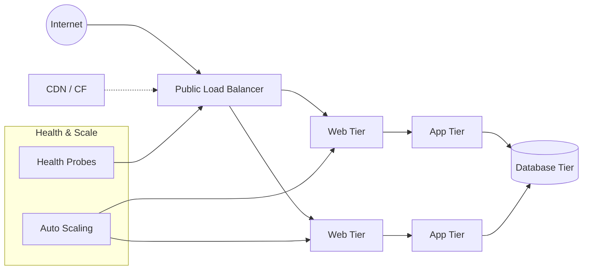
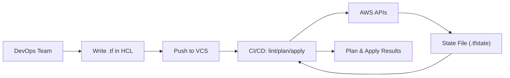

# #30daysofAWSTerraform

# Day 01 - Terraform Foundations

Terraform turns infrastructure from a manual chore into predictable, repeatable code. This first-day walkthrough explains why it matters, how it works, and gives you visual anchors to remember the flow.

## Why Terraform?

- Provision once, reuse everywhere: write configuration once and replicate environments reliably (dev -> prod -> DR).
- Faster delivery: a 3-tier stack that can take hours manually is minutes with automation.
- Safer changes: plans show what will happen before it happens; version control tracks every tweak.
- Easy cleanup: destroy environments when you no longer need them and stop paying for idle resources.

## Infrastructure as Code in a Nutshell

Translate your infrastructure into declarative code (servers, VPC, S3, IAM, firewalls, RDS, etc.). Popular IaC tools:

- Terraform (cloud agnostic)
- Pulumi (cloud agnostic)
- Azure ARM/Bicep (cloud native)
- AWS CloudFormation (cloud native)
- Deployment Manager / Config Connector (cloud native)

## The Reference Stack: 3-Tier Architecture

We'll use a classic three-tier pattern: public web, application logic, and data. Provisioning it by hand across multiple environments easily eats 2-12 hours.



## Why Manual Provisioning Hurts

- Slow and repetitive; needs more people as environments grow.
- Prone to human error and configuration drift ("works on my machine").
- Hard to secure consistently across environments.

## How Terraform Fixes It

- Consistent environments: DRY configs reduce drift across dev/test/prod.
- Repeatable lifecycle: `apply` to create/update, `destroy` to clean up.
- Visibility: plans show adds/changes/destroys before execution.
- Version control: track changes like any other codebase.

## Terraform Workflow (HCL + Pipelines)

Terraform uses HCL (`.tf` files) that are human- and machine-readable. You can run it locally or wire it into CI/CD.



Core commands you'll run (locally or in pipelines):

```bash
terraform init       # initialize providers and backends
terraform validate   # syntax and basic validation
terraform plan       # dry-run; shows proposed changes
terraform apply      # create/update/destroy to reach desired state
terraform destroy    # tear everything down when done
```

## Install the CLI

- Official install guide: https://developer.hashicorp.com/terraform/tutorials/aws-get-started/install-cli
- Check your version:

```bash
terraform version
# Terraform v1.14.0 on linux_amd64
```

- Quality-of-life tweaks:

```bash
alias tf=terraform   # shorter commands
terraform -install-autocomplete
```

## Editor Setup

- Install the VS Code Terraform extension for HCL syntax highlighting and linting.
- Quick start: create a workspace folder, add your first `.tf` file, run `tf init`, then `tf plan`.

## Watch: Terraform Install and Basics

[](http://www.youtube.com/watch?v=s5fwSG_00P8&t=6s "Terraform install and basics")
