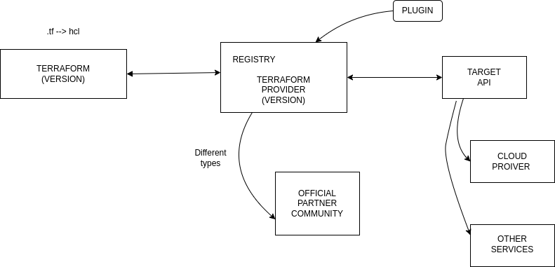

# #30daysofAWSTerraform

# Day 02 - Terraform Providers

Welcome back to the 30-day Terraform journey. Today is all about providers—the plugins that translate your HCL into API calls your cloud understands.

## What you’ll learn
- What a provider is and how it bridges Terraform with cloud APIs
- Types of providers you can use
- Where to find and read provider docs
- How to write a provider block with version constraints
- Why pinning versions matters and how to do it safely



## Providers 101
Terraform itself is just a binary; providers are the plugins that convert your configuration into API requests to provision resources (for example, AWS S3 or VPC). When you run `terraform init`, Terraform downloads the providers you declare so every subsequent command can translate your HCL into real API calls.

## Provider types
- Official: maintained by HashiCorp (AWS, Azure, GCP, etc.)
- Partner: maintained by third-party vendors
- Community: maintained by the open source community

Target APIs can be cloud endpoints or other services entirely.

## Read the docs
AWS provider docs: https://registry.terraform.io/providers/hashicorp/aws/latest/docs

## Wiring the provider
Define required providers and versions, then configure the provider. Terraform will fetch the plugin during `terraform init`.

```hcl
terraform {
  required_providers {
    aws = {
      source  = "hashicorp/aws"
      version = "~> 6.0" # Provider version
    }
  }
  required_version = ">= 1.0" # Terraform CLI version
}

provider "aws" {
  region = "us-east-1" # Hardcoded for this demo
}
```

Both Terraform and its providers have versions. If you do not pin them, Terraform defaults to the latest releases, which can introduce breaking changes.

## Why version pinning matters
Providers evolve quickly and may introduce compatibility issues with your Terraform version. Lock the versions you developed and tested with so you can reproduce the same behavior over time. Terraform writes these selections to `.terraform.lock.hcl` after `terraform init`; commit that file to keep environments consistent.

## Version constraint cheatsheet
- `=` exact version
- `!=` exclude a specific version
- `>`, `>=`, `<`, `<=` comparison-based ranges
- `~>` pessimistic constraint (allow safe updates within a minor series)

## Resource block anatomy
Every resource follows this shape:

```hcl
resource "<PROVIDER_TYPE>" "<LOCAL_NAME>" {
  # arguments (settings) go here
}
```

## Running `terraform init`

```bash
terraform init
```

Terraform will download providers (for example, `hashicorp/aws v6.22.1`) and create `.terraform.lock.hcl` to record the selections it made. After initialization, you can run `terraform plan` and `terraform apply`.

## Install AWS CLI (if needed)

```bash
curl "https://awscli.amazonaws.com/awscli-exe-linux-x86_64.zip" -o "awscliv2.zip"
unzip awscliv2.zip
sudo ./aws/install
```

## Sample plan output

```bash
terraform plan

# aws_vpc.example will be created
+ resource "aws_vpc" "example" {
    cidr_block         = "10.0.0.0/16"
    enable_dns_support = true
    enable_dns_hostnames = true
  }

Plan: 1 to add, 0 to change, 0 to destroy.
```

You now have the basics of providers, version pinning, and the provider block. Next up: building more resources with confidence.
