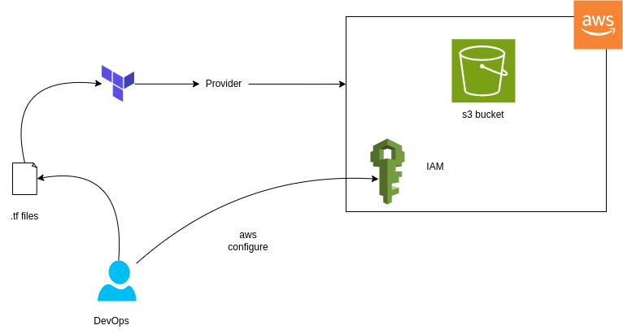
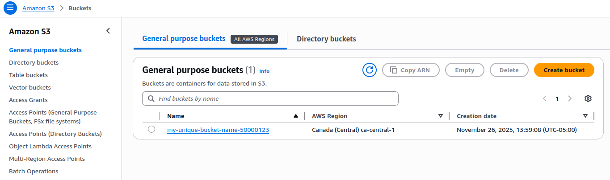
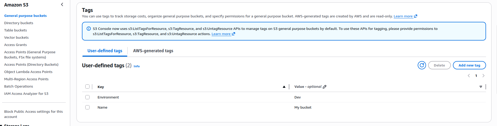

# #30daysofAWSTerraform

# Day 03 - Build and Tag an S3 Bucket with Terraform
Today we will provision an AWS S3 bucket with Terraform, add meaningful tags, and learn the workflow from init to destroy. This post reads like a mini how-to blog you can drop into GitHub.

### What you'll learn
- How Terraform talks to AWS through providers
- Writing a minimal S3 bucket resource with tags
- Running the Terraform workflow: init -> plan -> apply -> destroy
- Verifying your bucket in the AWS Console

### Prerequisites
- AWS account with credentials configured (`aws configure` to set `AWS_ACCESS_KEY_ID`, `AWS_SECRET_ACCESS_KEY`, and default region)
- Terraform CLI v1.0+ installed (`tf` alias works if you use it)
- A globally unique bucket name (S3 requires no duplicates across all AWS accounts)

### Architecture at a glance


### Terraform configuration

```hcl
terraform {
  required_providers {
    aws = {
      source  = "hashicorp/aws"
      version = "~> 6.0"
    }
  }
  required_version = ">= 1.0.0"
}

provider "aws" {
  region = "ca-central-1"
}

resource "aws_s3_bucket" "first_bucket" {
  bucket = "my-unique-bucket-name-50000123" # change to your own unique name

  tags = {
    Name        = "My bucket"
    Environment = "Dev"
  }
}
```

Key notes:
- The provider block authenticates using your AWS CLI credentials and operates in `ca-central-1`. Adjust the region if needed.
- Update `bucket` to a globally unique name; Terraform will fail if the name already exists.
- Tags help organize resources in cost reports and the console; feel free to expand them.

### Run it
From this `Day-03` directory:

```
terraform init        # downloads the AWS provider plugin
terraform plan        # shows the changes Terraform will make
terraform apply       # provisions the bucket (add --auto-approve to skip the prompt)
```

### Verify in AWS
- Check the S3 console for your new bucket and tags.
- CLI alternative: `aws s3api list-buckets | grep <your-bucket-name>`

### Clean up
Remove everything created by this configuration:

```
terraform destroy     # add --auto-approve to skip the prompt
```

### Outputs (console checks)




### Watch: Create an AWS S3 Bucket Using Terraform
[](http://www.youtube.com/watch?v=09HQ_R1P7Lw "Create an AWS S3 Bucket using Terraform")
