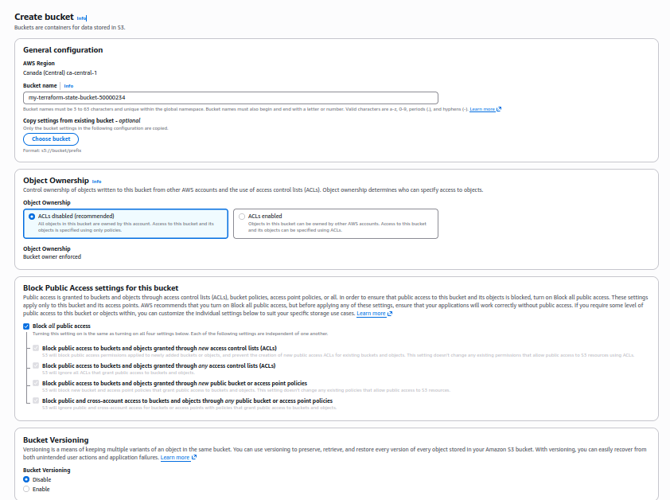
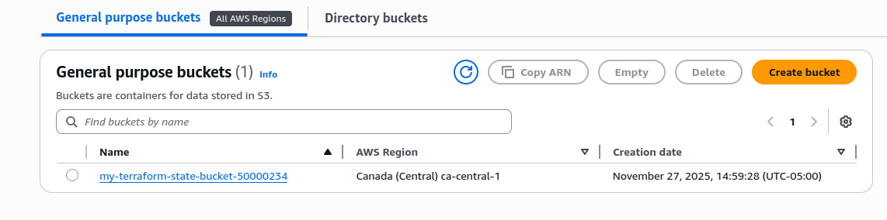
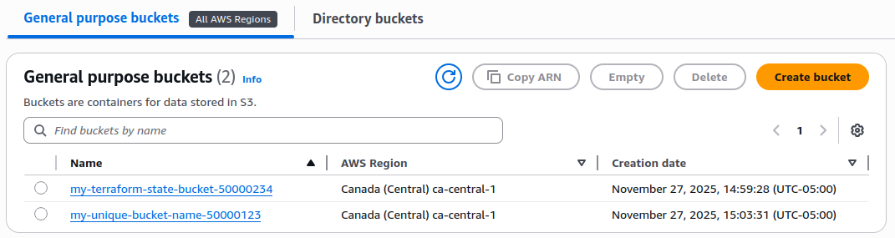

# #30daysofAWSTerraform

## Day 04 – Managing Terraform State with AWS S3

Terraform tracks the desired and actual state of your infrastructure in a state file. Keeping that file safe, consistent, and shareable is critical—especially when multiple people work on the same stack. This post walks through why remote state matters, how to set up an S3 backend, and the core commands you will use to inspect and manage Terraform state.

### What you will learn
- Why Terraform state matters and how it tracks desired vs. actual infrastructure.
- How to move state to an S3 backend (with optional DynamoDB locking) and initialize it safely.
- The core state commands (`list`, `show`, `pull`, `rm`, `import`, `mv`) and when to use each.
- Best practices to keep state secure, isolated per environment, and recoverable.

### How Terraform state works
- Terraform compares your configuration (desired state) to reality (actual state) using `terraform.tfstate`.
- The state file records resource IDs, metadata, and sensitive values. Treat it like a secret: never commit it to public repos and avoid manual edits.
- By default, state is local. Moving it to a remote backend (S3 here) gives you reliability, collaboration, and history.

### Why store state in S3
- Central source of truth for teams and automation.
- Durability and encryption at rest with S3.
- Optional DynamoDB table for state locking to prevent concurrent `plan`/`apply`.
- Easy separation by environment using different keys (e.g., `dev/terraform.tfstate`, `prod/terraform.tfstate`).

### Prerequisites
- AWS credentials with permission to create/read an S3 bucket (region used below: `ca-central-1`).
- A globally unique bucket name for the backend, e.g., `my-terraform-state-bucket-50000234`.
- (Recommended) A DynamoDB table with a primary key `LockID` for state locking.

### Step-by-step: configure an S3 backend
1. **Create the backend bucket**  
   Use the S3 console (or CLI) to create the bucket. Keep block public access on, enable encryption, and optionally enable versioning for rollback safety.  
     
   

2. **Add backend configuration** to your Terraform files:
   ```hcl
   terraform {
     backend "s3" {
       bucket         = "my-terraform-state-bucket-50000234"
       key            = "dev/terraform.tfstate" # path within the bucket
       region         = "ca-central-1"
       encrypt        = true
       dynamodb_table = "terraform-state-lock"  # optional but recommended
     }

     required_providers {
       aws = {
         source  = "hashicorp/aws"
         version = "~> 6.0"
       }
     }

     required_version = ">= 1.0.0"
   }

   provider "aws" {
     region = "ca-central-1"
   }

   # Example resource
   resource "aws_s3_bucket" "first_bucket" {
     bucket = "my-unique-bucket-name-50000123"

     tags = {
       Name        = "My bucket"
       Environment = "Dev"
     }
   }
   ```

3. **Initialize the backend**  
   If the bucket does not exist, `terraform init` will fail. Create the bucket first, then run:
   ```bash
   terraform init
   ```
   You should see `Successfully configured the backend "s3"!`

4. **Plan and apply**  
   ```bash
   terraform plan
   terraform apply --auto-approve
   ```
   Terraform will create the `aws_s3_bucket.first_bucket` resource and store the updated state in S3.  
   

5. **Verify the state in S3**  
   The `terraform.tfstate` file is uploaded to the key you specified.  
   

### Inspect and understand your state
- **List resources tracked in state**
  ```bash
  terraform state list
  # aws_s3_bucket.first_bucket
  ```
- **Show details for one resource**  
  Useful for checking tags, ARNs, and attributes without hitting AWS directly.
  ```bash
  terraform state show aws_s3_bucket.first_bucket
  ```
- **Pull raw state JSON**  
  ```bash
  terraform state pull
  ```
  Inspecting the JSON helps with debugging but avoid manual edits.

### Manage state entries safely
- **Remove a resource from state (stop managing it)**  
  ```bash
  terraform state rm aws_s3_bucket.first_bucket
  ```
- **Import an existing resource into state**  
  ```bash
  terraform import aws_s3_bucket.first_bucket my-unique-bucket-name-50000123
  ```
- **Rename/move a resource address** (e.g., refactor to `main_bucket`)  
  ```bash
  terraform state mv aws_s3_bucket.first_bucket aws_s3_bucket.main_bucket
  ```
After any state change, run `terraform plan` to confirm Terraform’s view matches reality.

### Cleanup and best practices
- Never edit `terraform.tfstate` by hand.
- Keep the backend bucket private; enable encryption and versioning.
- Use a DynamoDB table for state locking to prevent concurrent operations.
- Separate state files per environment or workspace.
- Back up state regularly; losing it means Terraform cannot track your infrastructure.
- When you are done with the lab, destroy resources to avoid costs:
  ```bash
  terraform destroy --auto-approve
  ```

### What I learned in this article
- Moving Terraform state to S3 makes collaboration safer and keeps state durable and centralized.
- Backend initialization fails if the bucket is missing—create it first, then run `terraform init`.
- DynamoDB (or S3 lock files) prevents concurrent plans/applies from corrupting state.
- `terraform state list` and `terraform state show` are the fastest ways to inspect what Terraform manages without hitting AWS APIs directly.
- State operations (`rm`, `import`, `mv`, `pull`) are powerful; follow each with `terraform plan` to ensure Terraform’s view matches reality.

### Watch: Terraform State file management with AWS S3 | Remote Backend
[](https://www.youtube.com/watch?v=YsEdrl9O5os "Terraform install and basics")
