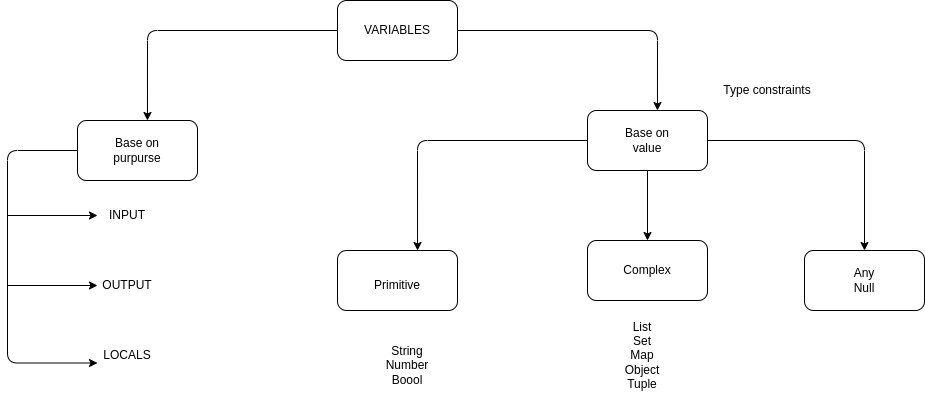

# #30DaysOfAWSTerraform

## Day 07 — AWS Terraform Type Constraints Explained (with real examples)

### Learning objectives
- Understand the major Terraform variable types and where they fit.
- See how type constraints prevent bad inputs before they hit AWS.
- Learn the difference between list, set, map, tuple, and object in real code.
- Know where defaults live and how `tfvars` overrides behave.

Terraform variables are guardrails, not paperwork. When you lock in their types, you stop surprises before they ever reach AWS. Below is a quick tour of how each constraint in the `terraform-manifest` folder shapes inputs and keeps your plans honest.



### Primitive types keep inputs predictable

Simple string, number, and boolean types keep Terraform from having to guess what you meant.

```hcl
variable "bucket_name" {
  description = "The name of the S3 bucket"
  type        = string
  default     = "my-unique-bucket-name-50000123"
}

variable "instance_count" {
  description = "Number of EC2 instances to create"
  type        = number
}

variable "monitoring_enabled" {
  description = "Enable detailed monitoring for EC2 instances"
  type        = bool
  default     = true
}
```

With `type = number`, the `aws_instance.my_ec2` resource can safely use `count` arithmetic without Terraform shrugging at the value shape.

### Lists vs. sets: ordering and uniqueness

Use lists when order matters and sets when you only care about membership.

```hcl
variable "allowed_vm_types" {
  description = "List of allowed VM instance types"
  type        = list(string)
  default     = ["t2.micro", "t2.small", "t3.micro", "t3.small"]
}

variable "allowed_region" {
  description = "List of allowed AWS regions"
  type        = set(string) # duplicates are removed; no index access
  default     = ["us-east-1", "us-west-2", "eu-west-1"]
}

resource "aws_instance" "my_ec2" {
  # Lists support stable indexing; sets need conversion before indexing.
  instance_type = var.allowed_vm_types[1]
  # region = var.allowed_region[0]        # invalid, sets are unordered
  # region = tolist(var.allowed_region)[0] # convert if indexing is required
  region = var.config.region
}
```

Lists keep your positional choices intact; sets automatically deduplicate and save you from unintentional repeats.

### Maps gather related keys

When you need flexible key-value pairs (like tags), maps keep everything under one variable while still enforcing value types.

```hcl
variable "tags" {
  description = "A map of tags to assign to resources"
  type        = map(string)
  default = {
    environment = "dev"
    Name        = "dev-instance"
    Owner       = "admin"
    Project     = "terraformdemo"
    Environment = "dev"
  }
}

resource "aws_instance" "my_ec2" {
  tags = var.tags
}
```

If someone slips a non-string value into `tags`, Terraform fails fast before touching AWS.

### Tuples lock both order and type

Tuples shine when you want a small, fixed schema that is position-dependent.

```hcl
variable "ingress_values" {
  description = "List of ingress port values"
  type        = tuple([number, string, number])
  default     = [443, "tcp", 443]
}

resource "aws_vpc_security_group_ingress_rule" "allow_tls_ipv4" {
  security_group_id = aws_security_group.allow_tls.id
  cidr_ipv4         = var.cidr_block[0]
  from_port         = var.ingress_values[0]
  ip_protocol       = var.ingress_values[1]
  to_port           = var.ingress_values[2]
}
```

Here, Terraform enforces that the first element is always a number (port), the second a string (protocol), and the third a number (port again), preventing swapped or mistyped values.

### Objects group configuration into one handle

Objects let you define structured inputs with named attributes and mixed types.

```hcl
variable "config" {
  description = "Configuration for the EC2 instance"
  type = object({
    region         = string
    monitoring     = bool
    instance_count = number
  })
  default = {
    region         = "us-east-1"
    monitoring     = true
    instance_count = 1
  }
}

resource "aws_instance" "my_ec2" {
  count                          = var.config.instance_count
  region                         = var.config.region
  monitoring                     = var.config.monitoring
  associate_public_ip_address    = var.associate_public_ip
  ami                            = "resolve:ssm:/aws/service/ami-amazon-linux-latest/al2023-ami-kernel-default-x86_64"
  tags                           = var.tags
}
```

Instead of juggling multiple primitives, consumers pass one `config` object and Terraform guarantees every attribute matches the expected type.

### Defaults, overrides, and tfvars

The defaults above make the module runnable out of the box, while `terraform.tfvars` overrides key values for each environment:

```hcl
environment    = "preprod"
instance_count = 1
```

Type constraints catch mismatches early if a `tfvars` file provides the wrong shape (for example, a string for `instance_count`).

### Summary

- Primitive types prevent obvious mistakes (e.g., using numbers where strings are expected).
- Lists keep order, sets enforce uniqueness; convert sets to lists before indexing.
- Maps centralize flexible key-value inputs like tags while enforcing value types.
- Tuples validate both order and element type for small, fixed sequences.
- Objects bundle mixed attributes so modules receive one predictable config block.
