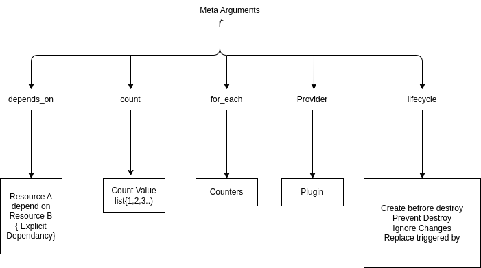
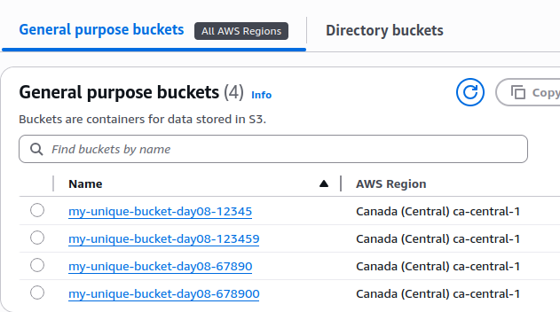

# #30DaysOfAWSTerraform

## Day 08 — AWS Terraform Meta Arguments Made EASY | Count, depends_on, for_each

### Learning objectives
- Understand what meta arguments are and why they differ from regular resource arguments.
- Know when to pick `count` vs. `for_each` (lists vs. sets/maps, stability of plans).
- Apply `depends_on` to control ordering when Terraform cannot infer it.
- Run the provided examples end-to-end and read the outputs with confidence.


Meta arguments are the little knobs Terraform understands on every resource block. They change how Terraform creates and wires resources rather than configuring the resource itself. If you have ever wondered, “How do I loop over resources or force one thing to wait for another?”, this is your day. We will master the three most common meta arguments—`count`, `for_each`, and `depends_on`—using the `terraform-manifest` examples in this folder.



### What we will build
- Create multiple S3 buckets using both `count` and `for_each`.
- Control creation order with `depends_on`.
- Output the created bucket names.

Key files live in `terraform-manifest/`:
- `providers.tf` defines the AWS provider in `ca-central-1`.
- `variables.tf` holds lists/sets of bucket names.
- `main.tf` uses meta arguments to create buckets.
- `outputs.tf` prints the bucket names after apply.

### Using `count` to scale a single resource
`count` tells Terraform how many instances of a resource to make. Terraform exposes `count.index` so you can plug in values for each instance. Think of it as “copy this block N times and give me the current copy number.”

`main.tf` uses a list variable `bucket_names` to create two buckets:

```hcl
resource "aws_s3_bucket" "my_bucket" {
  count  = 2
  bucket = var.bucket_names[count.index]
  tags   = var.tags
}
```

How it works:
- `count = 2` clones the `aws_s3_bucket` block twice.
- `count.index` is `0` for the first bucket, `1` for the second.
- Because `bucket_names` is a list, indexing is allowed. (Sets cannot be indexed deterministically.)

Tips:
- Use `count` when you want identical resources driven by a number or list position.
- Combine with `count.index` for per-instance tweaks (names, tags, ports, etc.).
- If the input is a list and order matters to you, `count` keeps the intent obvious.

### Using `for_each` for maps and sets
`for_each` creates one resource per element in a map or set, exposing `each.key` and `each.value`. Order is stable for maps and deterministic for sets after Terraform sorts them internally. It feels like a friendly “loop over these items, no indexes required.”

`main.tf` iterates over a set of names:

```hcl
resource "aws_s3_bucket" "bucket2" {
  for_each = var.bucket_names_set
  bucket   = each.value
  tags     = var.tags

  depends_on = [aws_s3_bucket.my_bucket]
}
```

Why `for_each` here:
- Sets and maps are natural inputs; you do not rely on numeric indexes.
- Adding/removing an element only affects that element’s resource, reducing churn in plans.
- It reads closer to intent: “make a bucket for each name I give you.”

Tips:
- Use a **map** when you need structured values and predictable keys (for tagging or per-item config).
- Use a **set** when uniqueness matters and you only need the value (`each.value`).

### Controlling order with `depends_on`
Terraform usually infers dependencies from references. When resources do not directly reference each other but still need ordering, declare it explicitly with `depends_on`. This is the “no surprises” button when you need Terraform to wait.

In the `for_each` example:

```hcl
depends_on = [aws_s3_bucket.my_bucket]
```

This forces every `bucket2` instance to wait until all `my_bucket` instances are created. Use `depends_on` for:
- Out-of-band ordering (e.g., S3 bucket policy depending on a bucket created via module).
- Null resources or provisioners that must run after another resource.
- Avoiding race conditions where providers have eventual consistency.

### Variables powering the examples
`variables.tf` provides:
- `bucket_names` (list) for `count`-driven buckets.
- `bucket_names_set` (set) for `for_each`.
- `tags` map reused across resources.

Feel free to override defaults in `terraform.tfvars` or via CLI flags.

### Running the demo
From `Day-08/terraform-manifest`:
1) `terraform init`
2) `terraform plan` to see the buckets Terraform will create.
3) `terraform apply` to provision.
4) `terraform output s3_bucket_name` to view created bucket names (see `outputs.tf`).




### Summary
- `count` clones a resource a fixed number of times and is great when indexing a list.
- `for_each` iterates maps/sets and keeps plans stable when items are added or removed.
- `depends_on` enforces creation order when Terraform cannot infer it automatically.
- Together these meta arguments give you precise control over scale, iteration, and orchestration in Terraform configurations.
