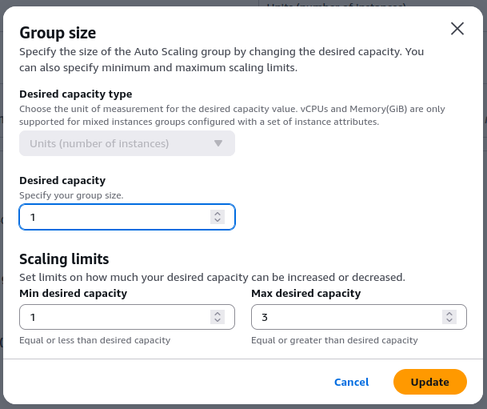
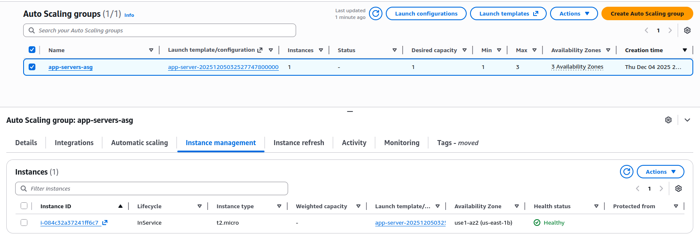
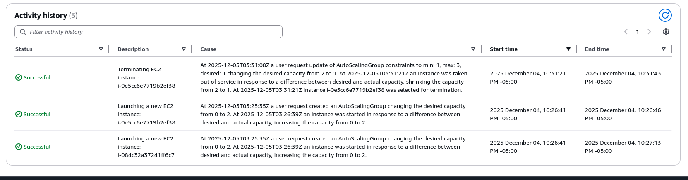

# #30DaysOfAWSTerraform

## Day 09 - AWS Terraform Lifecycle Rules Explained (simple English)

### Learning objectives
- Know what Terraform lifecycle rules are and why to use them.
- Keep uptime with `create_before_destroy` and avoid accidents with `prevent_destroy`.
- Let AWS manage scaling without drift using `ignore_changes`.
- Force safe replacements with `replace_triggered_by`.
- Stop bad applies up front with `precondition` and confirm results with `postcondition`.
- Read the AWS console output to see these rules in action.

### The Terraform script 
This is the heart of the demo in `terraform-manifest/main.tf`:
```hcl
provider "aws" { region = var.region }
data "aws_region" "current" {}

resource "aws_instance" "example" {
  ami           = "ami-0f00d706c4a80fd93"
  instance_type = var.allowed_vm_types[1]
  region        = var.region
  tags          = var.tags
  lifecycle { create_before_destroy = false } # set to true for zero downtime
}

resource "aws_s3_bucket" "my_bucket" {
  bucket = var.bucket_names[0]
  tags   = var.tags
  lifecycle { prevent_destroy = true }
}

resource "aws_autoscaling_group" "app_servers" {
  name             = "app-servers-asg"
  desired_capacity = 2
  min_size         = 1
  max_size         = 3
  launch_template { id = aws_launch_template.app_server.id, version = "$Latest" }
  lifecycle { ignore_changes = [desired_capacity] }
}

resource "aws_instance" "app_with_sg" {
  ami                    = "ami-0f00d706c4a80fd93"
  instance_type          = var.allowed_vm_types[0]
  vpc_security_group_ids = [aws_security_group.app_sg.id]
  lifecycle { replace_triggered_by = [aws_security_group.app_sg.id] }
}

resource "aws_s3_bucket" "compliance_bucket" {
  bucket = var.bucket_names[1]
  tags = merge(var.tags, { Name = "Compliance Bucket" })
  lifecycle {
    precondition {
      condition     = contains(var.allowed_region, data.aws_region.current.name)
      error_message = "Must deploy only in allowed regions"
    }
    precondition {
      condition     = contains(var.allowed_environments, var.environment)
      error_message = "Environment not approved for bucket creation"
    }
    postcondition {
      condition     = contains(keys(var.tags), "Compliance")
      error_message = "Bucket needs a Compliance tag"
    }
  }
}
```

### What each rule does

- `create_before_destroy`: Make the new resource first, then delete the old one. Good for zero downtime swaps. If set to `false`, expect a short outage during replace.
- `prevent_destroy`: Blocks deletion so nobody removes the bucket by mistake. Terraform will stop the plan.
- `ignore_changes`: Terraform ignores `desired_capacity` drift because AWS Auto Scaling manages it. Plans stay clean even when the console changes the number.
- `replace_triggered_by`: If the security group changes, recreate the instance so it always uses the latest rules.
- `precondition`: Fail fast before creating anything when region or environment is not allowed.
- `postcondition`: After creation, verify required tags exist (Compliance, Environment). If missing, Terraform throws an error.

### Console output from the run
- Scaling dialog while tuning the Auto Scaling Group size:  
  
- Instance list after scaling down (extra instances terminated, one kept running):  
  
- Auto Scaling Group showing desired/min/max after the change:  
  
- Activity history proving the scale-down and replacement events happened as expected:  
  

These match the lifecycle intent: Terraform did not fight the desired capacity change because of `ignore_changes`, and AWS handled the terminate/launch flow cleanly.

### How to run this yourself
1) Set `region`, `environment`, and `allowed_environments/allowed_region` in `terraform.tfvars`.  
2) Confirm AMI IDs exist in your region (update `main.tf` if needed).  
3) `terraform init`  
4) `terraform plan` (preconditions will fail if region/env are wrong).  
5) `terraform apply` and watch the AWS console while Terraform runs.

### Summary
Lifecycle rules let you shape Terraform's behavior: protect resources (`prevent_destroy`), reduce downtime (`create_before_destroy`), avoid drift fights (`ignore_changes`), force safe replacements (`replace_triggered_by`), and add guardrails (`precondition`/`postcondition`). With a few lines, your applies become safer, clearer, and closer to how you want AWS to behave.
